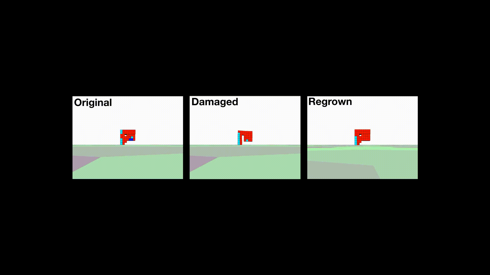

<!-- 
<p align="center">
  
</p> -->
Regeneration

Biped

Tripod

Multiped

## How to run
<!--  -->

```bash
# clone project   
git clone https://github.com/KazuyaHoribe/RegeneratingSoftRobots.git   

# install dependencies   
cd RegeneratingSoftRobots
pip install -r requirements.txt
```

You can run GA using a like below command.
```
python main_creatures.py --im_size 7 --number_neighbors 7 --popsize 50 --generations 101 --sigma 0.05 --N 10 --threads 4 --fig_output_rate 10
```

When you see a locomotion of a virtual creature, you need to build a physical simulator named "VoxCad" following this direction.
https://github.com/skriegman/evosoro  
NOTE: This simulator works only on Linux.