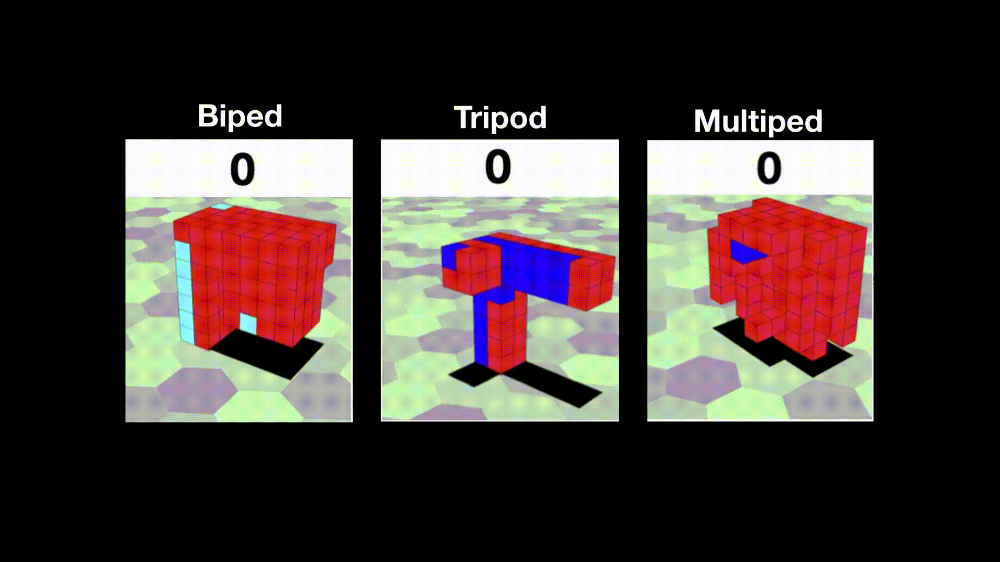

<!-- 
<p align="center">
  
</p> -->
# Regenerating soft robots through neural cellular automata  

### Regeneration  
  
### Biped  
  
### Tripod  
  
### Multiped  
  

## How to run
<!--  -->

Firstly, install Anaconda as python 2.7 distribution on your linux machine.  

```bash
# clone project   
git clone https://github.com/KazuyaHoribe/RegeneratingSoftRobots.git   

# install dependencies    
cd RegeneratingSoftRobots 
pip install -r requirements.txt
```

You can run GA using a following command.
```
python main_creatures.py --number_neighbors 7 --popsize 50 --generations 101 --sigma 0.03 --N 10 --threads 1 --fig_output_rate 10
```

When you see a locomotion of a virtual creature, you need to build a physical simulator named "VoxCad" following this direction.
https://github.com/skriegman/evosoro  

After evolving soft robots, you can test their regeneration using a following command.

```
python regeneration_task.py --number_neighbors 7 --popsize 50 --generations 101 --sigma 0.03 --N 10 --threads 1 --fig_output_rate 10
```

All arguments is shown using help command.  

```
python main_creatures.py
```

```
--im_size N           Size of creature
--voxel_types N       How many different types of voxels
--number_neighbors N  Number of neighbors
--initial_noise N     initial_noise
--sigma SIGMA         Sigma
--N N                 N
--simtime SIMTIME     Simulation time in voxelyze
--initime INITIME     Intiation time of simulation in voxelyze
--fraction FRACTION   Fraction of the optimal integration step. The lower, the more stable (and slower) the simulation.
--run_directory RUN_DIRECTORY
--run_name RUN_NAME
--popsize POPSIZE     Population size.
--generations GENERATIONS Generations.
--threads N           threads
--optimizer N         ga
--recurrent N         0 = not recurrent, 1 = recurrent
--data_read N         0 = not data read, 1 = dataread
--cell_sleep N        0 = not sleep, 0 = sleep
--growth_facter N     0 = not growt facter, 1 = growth facter exist
--seed N              seed
--folder N            folder to store results
--show N              visualize genome
--expression N        seperate gene expression
--fig_output_rate N   fig_output_rate
```

##  Reproduction of paper's results
<!--  -->

We used these parameters for each experiments in both recurrent and non-recurrent running.
Task _ID means the number of independent running.  

# 2D soft robots  
codes: main_creatures_2d, evaluation_2d, GA_2d, read_write_voxelyze_2d
--popsize 300  
--generations 501  
--sigma 0.03  
--N 60  
--recurrent 0/1 
--seed TASK_ID  

# 3D soft robots
codes: main_creatures, evaluation, GA, read_write_voxelyze
--dimension 1  
--initial_noise 1  
--popsize 100  
--N 20  
--generations 301  
--sigma 0.03  
--recurrent 0/1  
--seed TASK_ID  

# Regeneration task
codes: regeneration_task
--popsize 1000  
--generations 1001  
--sigma 0.03  
--N 200
--recurrent 0/1 
--seed TASK_ID  